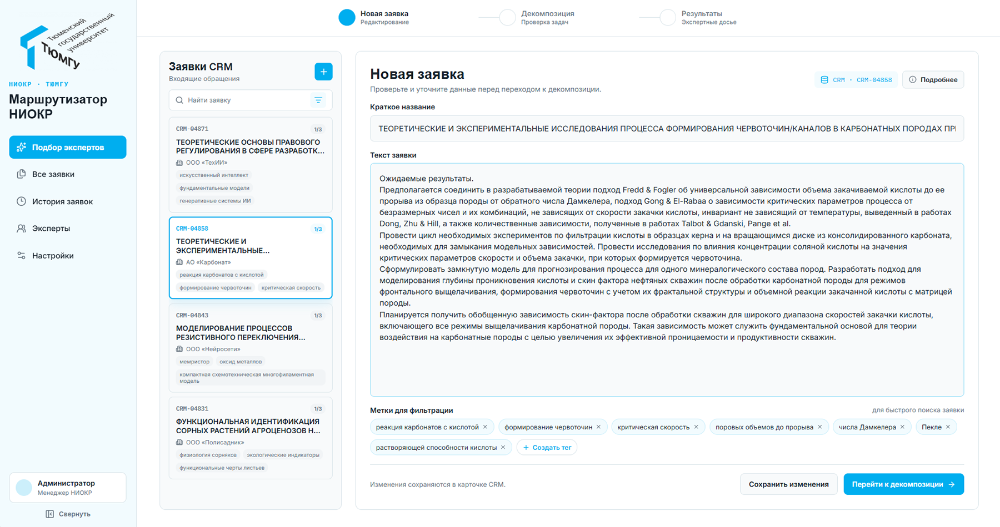
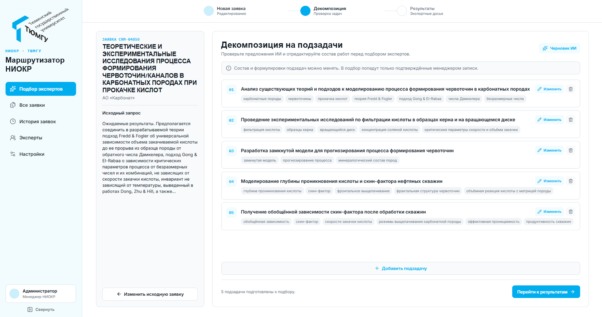
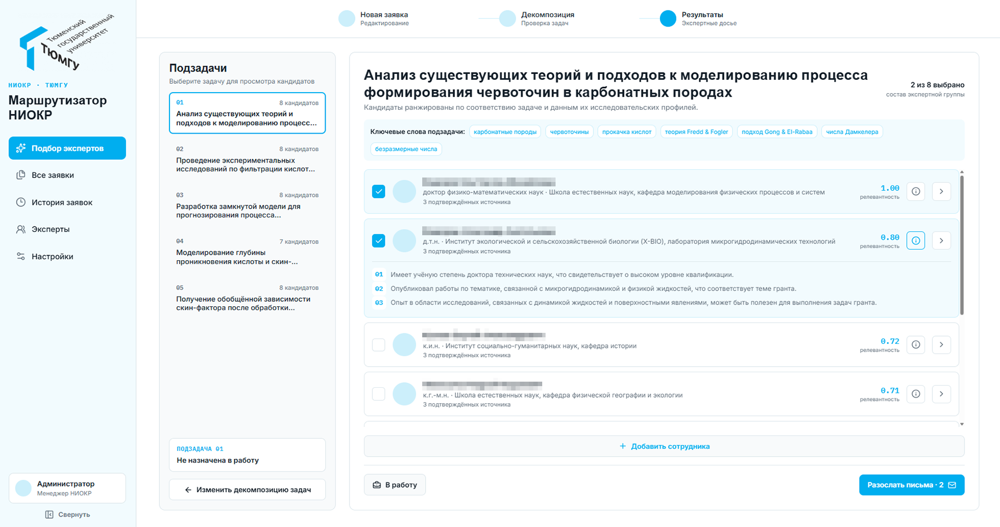

# R&D Router

R&D Router подбирает исследователей под входящие R&D-запросы, разбивает запрос на подзадачи, ранжирует кандидатов по их портфолио для конкретной подзадачи и готовит персональные письма-приглашения. Веб-интерфейс работает с FastAPI и Yandex AI Studio.

## Быстрый запуск в Docker

Нужен Docker с плагином Compose и подготовленные файлы `data/profiles.json` и `data/index.parquet` (см. ниже). Создайте файл с настройками Yandex AI Studio и запустите приложение:

```powershell
Copy-Item .env.example .env
# Заполните LLM_FOLDER_ID и LLM_API_KEY в .env
docker compose up --build -d
```

Контейнер API собирается из `python:3.12-slim` и устанавливает зависимости через `pip`.

После запуска интерфейс доступен по адресу <http://localhost:8080>, API — по адресу <http://localhost:8080/api/v1>, а Swagger — по адресу <http://localhost:8080/docs>.

Проверить состояние контейнеров и остановить приложение:

```powershell
docker compose ps
docker compose down
```

API не публикуется отдельным портом: к нему обращается только контейнер веб-интерфейса. Логи доступны командой `docker compose logs -f`.

## Интерфейс

Рабочий сценарий состоит из трёх шагов: менеджер проверяет входящую заявку, уточняет предложенную декомпозицию, а затем выбирает исследователей для каждой подзадачи.

### 1. Входящая заявка

Заявка из CRM содержит описание задачи и метки для последующего поиска.



### 2. Декомпозиция на подзадачи

Система предлагает набор подзадач и ключевых слов. Перед запуском подбора менеджер может отредактировать формулировки.



### 3. Ранжирование исследователей

Для каждой подзадачи кандидаты ранжируются по семантическому соответствию. В интерфейсе отображаются оценка, подтверждающие источники и причины рекомендации.



## Настройка

Переменные окружения задаются в корневом `.env`; пример приведён в `.env.example`.

| Переменная | Назначение |
| --- | --- |
| `LLM_FOLDER_ID` | Идентификатор каталога Yandex Cloud. |
| `LLM_API_KEY` | API-ключ для Yandex AI Studio. |
| `LLM_CHAT_MODEL` | Модель для декомпозиции запросов и писем. |
| `LLM_EMBEDDING_MODEL` | Базовое имя модели эмбеддингов. |
| `LLM_COMPLETION_TIMEOUT` | Тайм-аут запросов к модели, в секундах. |
| `LLM_EMBEDDING_TIMEOUT` | Тайм-аут запросов эмбеддингов, в секундах. |

Файл `.env` не попадает в образ и не должен добавляться в Git.

## Данные исследователей

Для работы API нужны `data/profiles.json` и `data/index.parquet`. Они исключены из Git, так как могут содержать персональные данные. Папка `data/` монтируется в backend-контейнер как `/app/data` в режиме только для чтения и не входит в Docker-образ.

Если исходные профили Markdown изменились, пересоберите данные локально, затем запустите контейнеры. Для генерации нужен [uv](https://docs.astral.sh/uv/) и заполненный `.env` для обращения к Yandex AI Studio:

```powershell
cd backend
uv sync
uv run python -m infrastructure.profile_parser
uv run python -m infrastructure.index_builder
cd ..
docker compose up --build -d
```

Скрипт парсинга читает `data/profiles_raw/` и создаёт `data/profiles.json`; построение индекса создаёт `data/index.parquet`. Эти команды выполняются вне Docker-сборки, поскольку используют приватные исходные данные и внешний API.

## Разработка без Docker

Для backend нужен Python 3.10+; ниже используется [uv](https://docs.astral.sh/uv/) как удобный менеджер зависимостей. Он не обязателен: для обычного запуска API можно создать виртуальное окружение и установить `backend/requirements.txt` через `pip`. Для frontend нужен актуальный Node.js 22.x (LTS) или выше.

```powershell
# Терминал 1: API
# из корня проекта
cd backend
uv sync
uv run uvicorn --app-dir src api.app:app --reload

# Терминал 2: веб-интерфейс
# из корня проекта
cd frontend
npm ci
npm run dev
```

В режиме разработки Vite доступен по адресу <http://localhost:5173> и проксирует запросы API на `localhost:8000`.

## Тесты

```powershell
# из корня проекта
cd backend
uv run pytest

# из корня проекта
cd frontend
npm run build
```

## Структура проекта

- `backend/src/domain` — модели предметной области;
- `backend/src/services` — поиск, ранжирование и подготовка писем;
- `backend/src/infrastructure` — Yandex AI Studio, профили и векторный индекс;
- `backend/src/api` — HTTP API FastAPI;
- `frontend/src` — React-интерфейс;
- `data` — исходные профили и runtime-данные;

---

Данный проект выполнен командой студентов-разработчиков в рамках мероприятия **Большая математическая мастерская (БММ-2026) ТюмГУ**.
